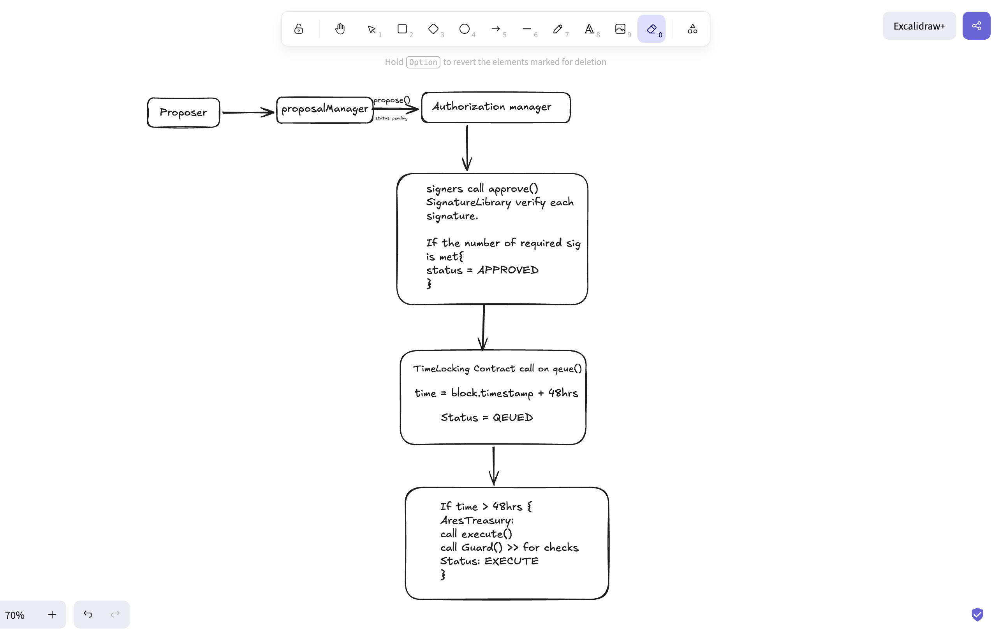

# Bodies to be considered in the implementation of this DAO Treasury contract:
- Token holders
- Delegates
- Contributors

# Concepts of the project:
This is simply the act of managing the financial assets of an Organisation using smartcontracts. Which allows only the authorized members of that Organization or let say token holders to either vote on decisions or assign delegates to make decisions on their behalf. This is a very important aspect of any DAO as it ensures that the funds are used in a way that aligns with the goals and values of the community and it also provides transparency and accountability in the management of the funds.

# Property to be considered:
- There will be a Governance Token.
- It will be transparent and auditable.
- The rules will be encoded in smart contracts.
- There should be a voting mechanism for decision making.

# Smart Contract Structure:
This contracts will be split into modules and core contracts:
- `Treasury.sol`: main contract that holds the funds and calls the other modules || Core contract
- `ProposalHub.sol`: handles proposal creation, tracking, and lifecycle || Module Contract
- `AuthLayer.sol`: manages off-chain signatures and authorization logic || Module Contract
- `Timelock.sol`: implements the timelock mechanism for queued proposals || Module Contract
- `Rewards.sol`: manages merkle-based reward claims for contributors || Module Contract
- `Guard.sol`: implements security checks like drain limits and flash loan attacks prevention || Module Contract

** Also there will be an implementation of interface for all the modules and core contract to ensure that they are working as expected and to make it easier for testing and maintenance. 

** Instead of storing contributors addresses in the contract and itirating over them for distribution of rewards, using merkle trees to help with the gas cost and also to make it more efficient. So for this I will have a merkle library that will help to generate the merkle root and also to verify the proofs.

** Also to ensure that signers signture are not reusable for other proposal or on another chain, and can only be used for proposals on this contract and only once, A SignatureLibrary will be implemented to handle the signature verification and also to keep track of the used signatures and nonces.

## Workflow for a proposal:
1. A token holder creates a proposal via `ProposalHub.propose()`, which emits a `ProposalCreated` event with a unique `proposalId`.
2. Authorized signers call `AuthLayer.approve(proposalId, signature)`, which verifies the signature and tracks approvals.
3. Once the approval threshold is met, anyone can call `Timelock.queue(proposalId)`, which records the execution timestamp (`eta`).
4. After the delay has passed, anyone can call `Timelock.execute(proposalId)`, which checks the timelock, reentrancy guard, and executes the proposal's actions via low-level `call`.
5. Contributors can claim rewards by calling `Rewards.claim(recipient, amount, proof)`, which verifies the merkle proof and transfers tokens if valid.
6. `Guard` is called before any execution to check for drain limits and flash loan attack prevention.
   

## Materials used for the implementation: 
- https://rareskills.io/post/governance-contract-solidity
- https://www.cube.exchange/what-is/treasury-management-dao