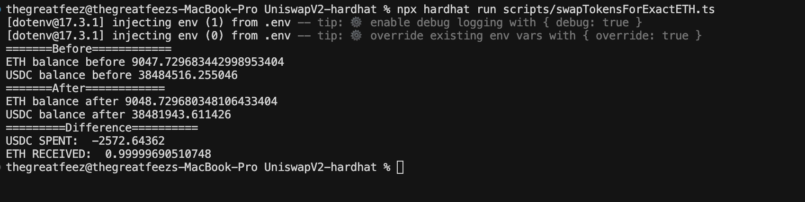

# Uniswap V2 Hardhat Scripts

Hardhat scripts for interacting with Uniswap V2 Router on Ethereum mainnet (via fork).

## Setup

```bash
npm install
```

Create a `.env` file with your mainnet RPC URL:

```
MAINNET_RPC_URL=https://eth-mainnet.g.alchemy.com/v2/YOUR_API_KEY
```

## Scripts

### Swap Scripts

| Script | Description |
|--------|-------------|
| `swapExactTokensForTokens` | Swap exact amount of input tokens for minimum output tokens |
| `swapTokensForExactTokens` | Swap tokens to receive exact amount of output tokens |
| `swapTokensForExactETH` | Swap tokens to receive exact amount of ETH |
| `swapETHForExactTokens` | Swap ETH for exact amount of tokens |
| `swapExactETHForTokens` | Swap exact amount of ETH for minimum output tokens |

### Run Commands

```bash
# Swap exact USDC for DAI (min 900 DAI for 1000 USDC)
npx hardhat run scripts/swapExactTokensForTokens.ts

# Swap USDC for exactly 1000 DAI (max 1100 USDC)
npx hardhat run scripts/swapTokensForExactTokens.ts

# Swap USDC for exactly 1 ETH (max 3500 USDC)
npx hardhat run scripts/swapTokensForExactETH.ts

# Swap ETH for exact tokens
npx hardhat run scripts/swapETHForExactTokens.ts

# Swap exact ETH for tokens (0.5 ETH for min 500 USDC)
npx hardhat run scripts/swapExactETHForTokens.ts

# Add liquidity
npx hardhat run scripts/addLiquidity-forking.ts
```

## Results

<details>
  <summary>SwapExactTokensForTokens</summary>

  

</details>

<details>
  <summary>SwapTokensForExactTokens</summary>

  

</details>

<details>
  <summary>SwapTokensForExactETH</summary>

  

</details>
